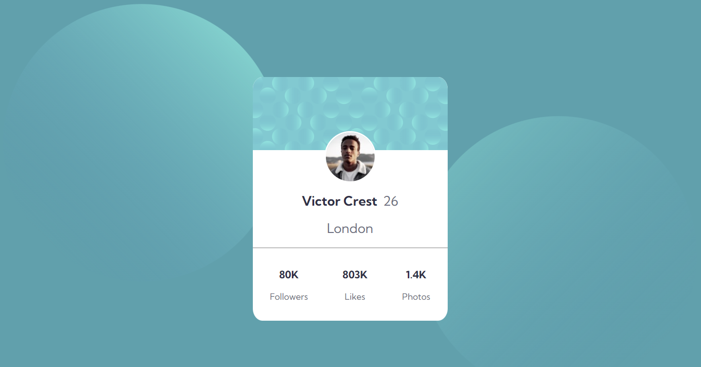
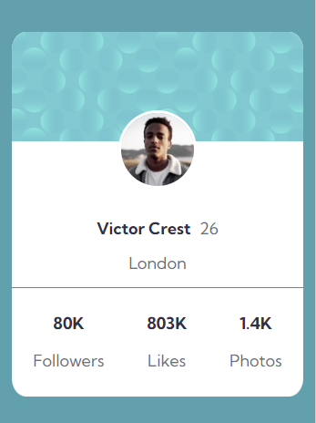

# Frontend Mentor - Profile card component solution

This is a solution to the [Profile card component challenge on Frontend Mentor](https://www.frontendmentor.io/challenges/profile-card-component-cfArpWshJ). Frontend Mentor challenges help you improve your coding skills by building realistic projects. 

## Table of contents

- [Overview](#overview)
  - [The challenge](#the-challenge)
  - [Screenshot](#screenshot)
  - [Links](#links)
- [My process](#my-process)
  - [Built with](#built-with)
  - [What I learned](#what-i-learned)
  - [Continued development](#continued-development)

## Overview

### The challenge

- Build out the project to the designs provided

### Screenshot

### Links

- Solution URL: [https://github.com/joshlitam/profile-card-component](https://your-solution-url.com)
- Live Site URL: [https://joshlitam.github.io/profile-card-component/](https://your-live-site-url.com)

## My process

### Built with

- Semantic HTML5 markup
- CSS custom properties
- Flexbox

### What I learned

I learned how to center elements using flexbox instead of relying on margins and paddings.

### Continued development

Continued development of this solution includes properly aligning the background elements

## Author

- Website - [Josh](https://github.com/joshlitam/)
- Frontend Mentor - [@josh](https://www.frontendmentor.io/profile/joshlitam)
